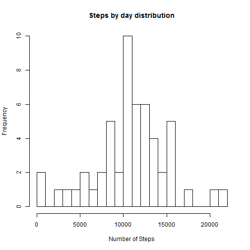
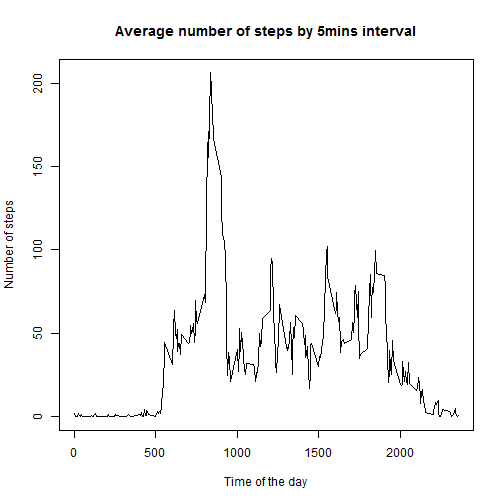
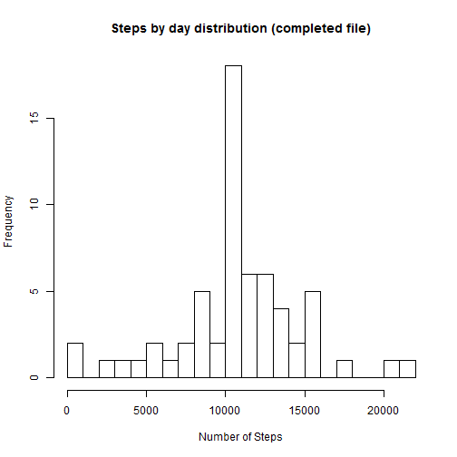
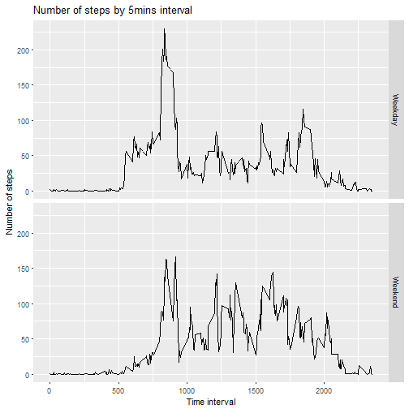

Peer-graded Assignment: Course Project 1
========================================

In the next lines, the questions included in this assignment will be answered.

### Loading and preprocessing the data

This code unzip and read the source file:

```r
file <- read.csv(unz("activity.zip", "activity.csv"))
```

The variable "date" is converted to Date format, using "lubridate" library:

```r
library(lubridate)
file$date <- ymd(file$date)
```

### What is mean total number of steps taken per day?
The number of steps by day is calculated by aggregation, and the histogram is shown:

```r
byday <- aggregate(steps ~ date, data=file, FUN=sum, na.rm=TRUE)
hist(byday$steps, breaks = 20, xlab=NULL, main=NULL)
title(main="Steps by day distribution", xlab="Number of Steps")
```



The mean of the steps by day is:

```r
mean(byday$steps)
```

```
## [1] 10766.19
```
The median of the steps by day is:

```r
median(byday$steps)
```

```
## [1] 10765
```

### What is the average daily activity pattern?

The average number of steps by 5-mins interval is calculated with aggregation function:

```r
by5mins <- aggregate(steps ~ interval, data=file, FUN=mean, na.rm=TRUE)
plot(by5mins$interval,by5mins$steps, type="l", main="Average number of steps by 5mins interval", xlab="Time of the day", ylab="Number of steps")
```



The 5mins interval with the maximum number of steps, in average, is calculated:

```r
by5mins$interval[which.max(by5mins$steps)]
```

```
## [1] 835
```

### Imputing missing values

Calculation of the total number of 5 min intervals without measures (*NA*):

```r
sum(is.na(file$steps))
```

```
## [1] 2304
```

The proposed strategy to imputate the empty samples is to do the average of 2 values:
- Average of all the samples in the same time interval ("avginterval")
- Average of all the samples in the same day ("avgday")


```r
# Get means for each criterion (intervals, days)
by5mins.avg <- by5mins
byday.avg <- aggregate(steps ~ date, data=file, FUN=mean, na.rm=TRUE)

# Merging all these means to calculate the average of both per each combination
newfile <- merge(file, byday.avg, by="date", all.x=TRUE)
newfile <- merge(newfile, by5mins.avg, by="interval", all.x=TRUE)
newfile$impute <- rowMeans(cbind(newfile$steps.y,newfile$steps), na.rm=TRUE)

# Filling the NAs with the new value
newfile$steps.x[is.na(newfile$steps.x)] <- newfile$impute[is.na(newfile$steps.x)]

# Creation of the new file similar to the original one
newfile <- data.frame(steps = newfile$steps.x,
                      date = newfile$date,
                      interval = newfile$interval)
```

With the new file completed, the previous analysis is repeated. The number of steps by day histogram:

```r
byday <- aggregate(steps ~ date, data=newfile, FUN=sum, na.rm=TRUE)
hist(byday$steps, breaks = 20, xlab=NULL, main=NULL)
title(main="Steps by day distribution (completed file)", xlab="Number of Steps")
```



The mean of the steps by day is:

```r
mean(byday$steps)
```

```
## [1] 10766.19
```
The median of the steps by day is:

```r
median(byday$steps)
```

```
## [1] 10766.19
```

There is almost no effect of imputing the missing values. The mean and median are almost the same.


### Are there differences in activity patterns between weekdays and weekends?

A new factor variable will be included in the dataset to differenciate between weekday and weekend day:


```r
# Setting local configuration in English
Sys.setlocale("LC_TIME", "US")
```

```
## [1] "English_United States.1252"
```

```r
weekenddays <- weekdays(newfile$date, abbreviate = TRUE)=="Sun" | weekdays(newfile$date,abbreviate = TRUE)=="Sat"

newfile$typeofday[weekenddays] <- "Weekend"
newfile$typeofday[!weekenddays] <- "Weekday"
newfile$typeofday <- as.factor(newfile$typeofday)
```

This is a plot to show the difference between weekday and weekend day (using "ggplot2" library):

```r
library(ggplot2)
byinterval <- aggregate(steps ~ interval+typeofday, data=newfile, FUN=mean)
ggplot(data=byinterval, aes(interval,steps)) + geom_line() + facet_grid(typeofday~.) + labs(title="Number of steps by 5mins interval", x="Time interval", y="Number of steps")
```



